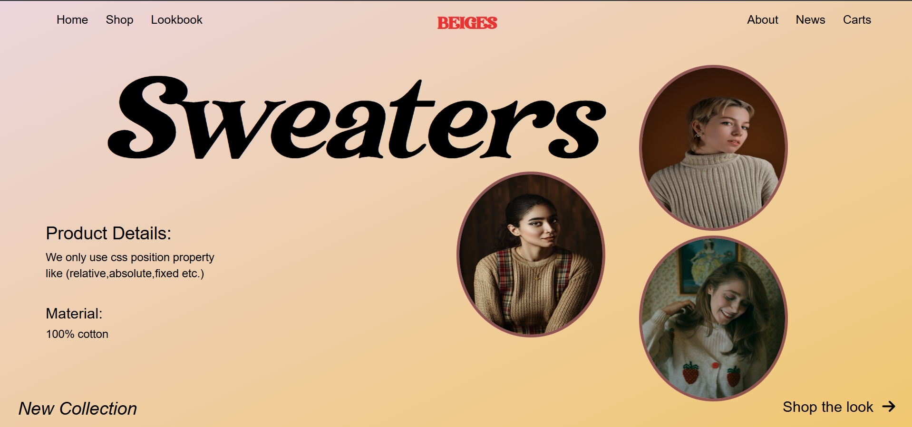

# 🧥 Sweaters — Modern Winter Collection ❄️  

Welcome to the *Sweaters Collection Website, a clean and elegant front page design built using **HTML & CSS*.  
This project highlights modern web styling with a soft color palette, smooth hover effects, and a stylish layout for showcasing products.  

---

## ✨ Features  

- 🎨 *Elegant UI Design* — Minimal and cozy theme perfect for winter vibes.  
- 🧶 *Product Showcase* — Beautiful circular product images for a neat and modern look.  
- 🧭 *Interactive Navbar* — Added smooth *hover effects* on all navbar links for a premium experience.  
- 💡 *CSS Positioning Practice* — Used position properties like relative, absolute, and fixed effectively.  
- 🌈 *Typography Focused* — Big, bold “Sweaters” title with beautiful font styling for better aesthetics.  

---

## 🛠️ Technologies Used  

- *HTML5* — For webpage structure  
- *CSS3* — For styling, animations, and layout  
  - Flexbox for alignment  
  - CSS position properties  
  - Transition effects for hover animations  

---

## 🔍 Product Details  

*Material:* 100% Cotton  
*Note:* Designed purely for learning and front-end design practice.  

---

## 📸 Preview




---

## 🚀 How to Use

1. Clone the repository
   ```bash
   git clone
