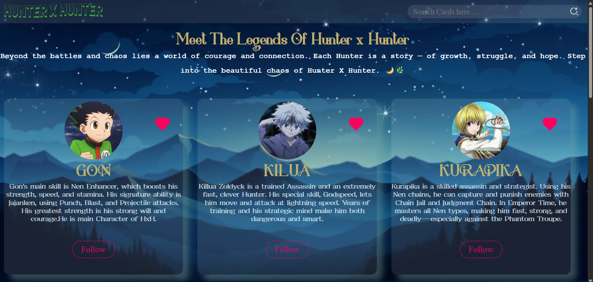

# 🌟 Hunter X Hunter Character Cards

A simple and creative **HTML & CSS** project inspired by *Hunter × Hunter*.
It features multiple anime character cards with hover effects, like & follow buttons, and a cool background design.

---

## ✨ Features

- 🎴 Multiple **character cards** (Gon, Killua, Kurapika & more)
- 💖 **Like icons** and 👤 **Follow buttons** for interactivity
- 🔍 **Search bar** to find characters easily
- 🌈 **Smooth hover effects** using `transform` and `translate`
- 🌌 **Attractive background image** for anime-style visuals

---

## 🖼️ Preview

>

---

## 🛠️ Built With

- **HTML5** – structure and layout
- **CSS3** – styling, hover animations, transitions

---

## 🚀 How to Use

1. Clone or download the repository.
2. Open `index.html` in your browser.
3. Explore the characters and enjoy the effects!

---

## 💫 Credits

Inspired by the anime *Hunter × Hunter*
Built with 💻 HTML & CSS only.
